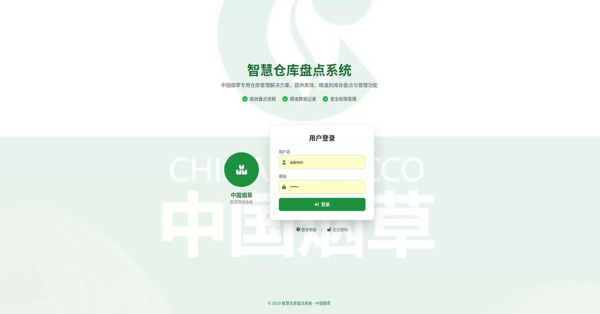
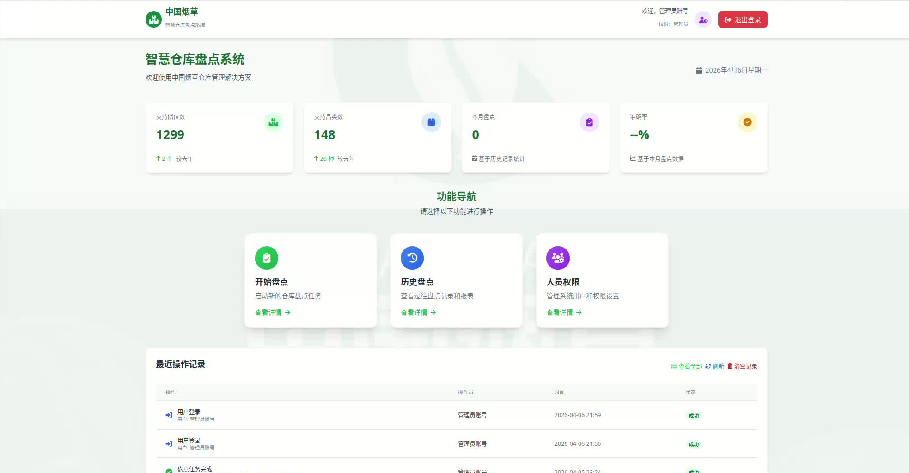
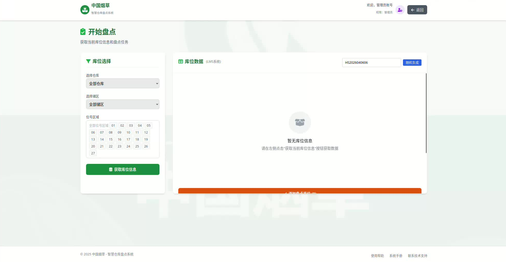
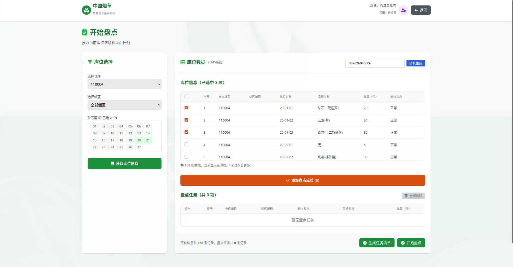
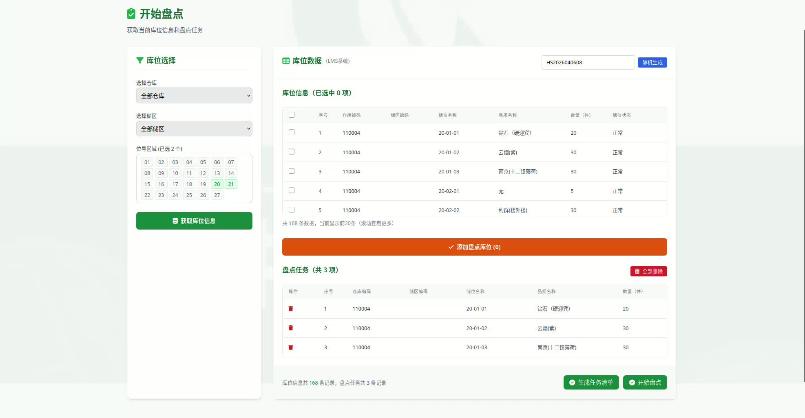
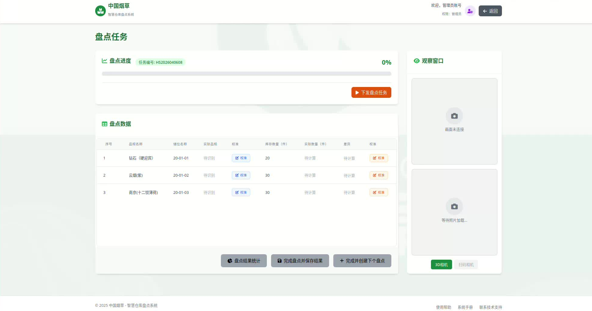
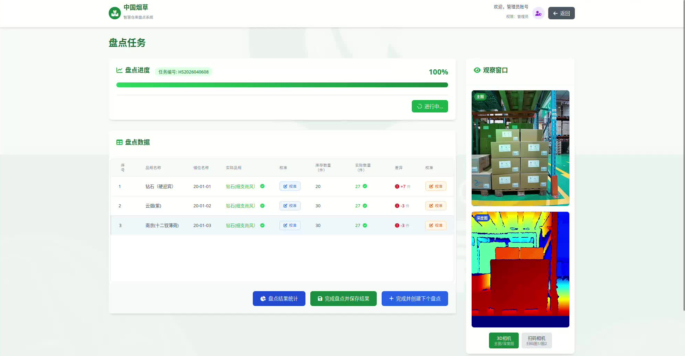
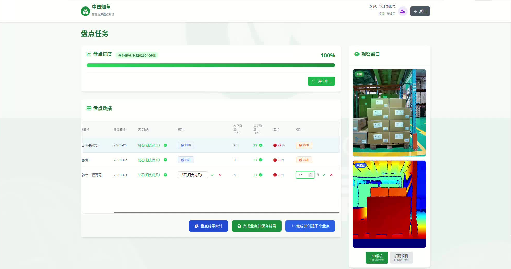
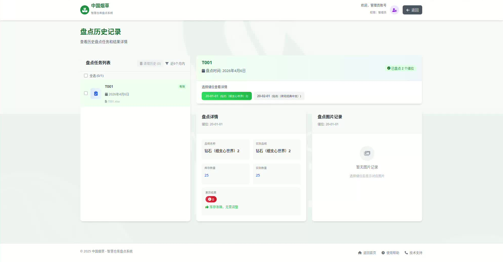
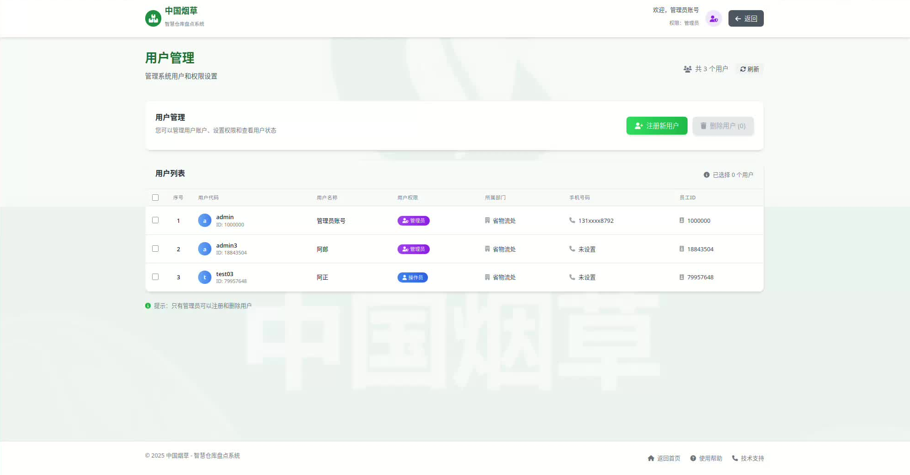

# 智慧仓库盘点系统 — 用户操作手册

> 适用版本：v2.0 | 最后更新：2026-04-06

---

## 重要说明

> **请在使用前仔细阅读以下内容。**

### 识别原理与限制

本系统的盘点识别依赖**计算机视觉算法**，识别效果受以下因素影响：

- **垛堆条件**：箱子必须按照正常的堆放和拿取方式进行堆叠，垛型需符合系统预设的类型（如 5×8、5×6、5×5、3×10、4×7+2 等）。若货物堆放方式与预设垛型不符，识别准确率将显著下降。
- **光线条件**：识别效果与光照情况强相关。若物件表面**反光严重**（如塑料薄膜包装）、**环境光过强**（直射强光）或**环境光过弱**（昏暗），均可能导致相机无法正常识别，需调整光源或清洁镜头后再试。
- **识别规律**：盘点次数越多、样本越丰富，算法的识别准确率越高。
- **盘点数量依赖**：实际盘点数量与视觉检测数量之间的差异，需要通过多次盘点来逐步校准和缩小。

### 网络依赖

本系统对机器人调度和相机控制的指令均通过**网络传输**实现，对现场网络环境有较高依赖。网络不稳定时可能出现指令延迟、抓图失败等问题。

### 服务状态

若发现系统页面无法打开或无法登录，请首先确认服务是否已启动。重启服务器后需同步重启 Gateway 服务（执行 `./manage.sh restart` 或手动重启），服务方可正常访问。

---

## 一、登录

打开系统首页，输入用户名和密码，点击**登录**按钮提交。



| 元素 | 说明 |
|------|------|
| 用户名 / 密码输入框 | 由系统管理员分配，连续 3 次输错锁定 5 分钟 |
| 登录按钮 | 提交认证请求，过程中显示加载状态 |

### 登录页面附加功能

| 按钮 | 位置 | 功能 |
|------|------|------|
| **登录帮助** | 登录表单下方 | 弹出权限说明，介绍操作员和管理员的可操作范围 |
| **忘记密码** | 登录表单下方 | 弹出管理员联系方式，需联系管理员重置密码 |

---

## 二、系统首页（Dashboard）

登录成功后自动进入首页，显示系统运行状态和快捷入口。



### 2.1 顶部导航栏

| 元素 | 说明 |
|------|------|
| 用户欢迎语 | 显示当前登录用户名，如"欢迎，张三" |
| 角色徽章 | 紫色圆形 = **管理员**，蓝色圆形 = **操作员** |
| **退出登录** 按钮 | 红色按钮，点击后退出当前会话，返回登录页 |

### 2.2 统计卡片（4 栏）

| 卡片 | 数据来源 | 说明 |
|------|---------|------|
| 支持储位数 | 后端实时统计 | 系统已接入的库位总数量 |
| 支持品类数 | 后端实时统计 | 系统已录入的烟品类别数 |
| 本月盘点 | 历史记录统计 | 当月已完成的盘点任务累计次数 |
| 准确率 | 历史记录统计 | 本月盘点中"实际数量 = 库存数量"的库位占比 |

### 2.3 功能导航卡片（3 栏）

点击任意卡片跳转到对应功能页面。

| 卡片 | 跳转目标 | 说明 |
|------|---------|------|
| **开始盘点** | `/inventory/start` | 创建并下发新的盘点任务 |
| **历史盘点** | `/inventory/history` | 查看近 6 个月的盘点记录 |
| **人员权限** | `/user_manage` | 管理用户账户（管理员专有） |

### 2.4 最近操作记录

展示当前用户最近的 10 条操作流水。

| 按钮 | 位置 | 功能 |
|------|------|------|
| **查看全部 / 收起** | 表格右上 | 切换显示最近 5 条和全部记录 |
| **刷新** | "查看全部"右侧 | 重新加载操作记录（页面整体刷新） |
| **清空记录** | "刷新"右侧（仅管理员可见） | 清空当前用户全部操作日志，需浏览器确认 |

**状态标签颜色**：

| 颜色 | 标签文字 | 含义 |
|------|---------|------|
| 🟢 绿色 | 成功 | 操作正常完成 |
| 🟡 黄色 | 部分成功 | 部分完成，存在异常 |
| 🔵 蓝色 | 进行中 | 任务执行中 |
| 🔴 红色 | 失败 | 操作失败 |

### 2.5 系统公告

展示当前公告信息，包括运维联系方式和历史数据保留说明。

---

## 三、创建盘点任务

点击首页**开始盘点**卡片，进入任务创建页面。

### 3.1 任务编号



| 元素 | 说明 |
|------|------|
| 任务编号输入框 | 系统自动按格式 `HS + 年月日 + 当日序号` 生成（如 `HS2026040601`），可手动覆盖修改 |

### 3.2 库位筛选区

通过下拉条件缩小库位范围，再在结果表格中勾选。

| 控件 | 功能 |
|------|------|
| **仓库** 下拉框 | 按仓库筛选（可多仓库数据时使用） |
| **储区** 下拉框 | 按储区（区域）筛选 |
| **位号** 下拉框 | 按位号前缀筛选（如选 `01` 则匹配 `01-01-01`、`01-02-03` 等），支持多选 |
| **搜索** 按钮 | 根据以上条件查询库位，结果显示在下方表格 |

下拉选项数据从系统 `bins_data.xlsx` 动态加载，初次进入页面时自动获取。

### 3.3 库位结果表格



| 列名 | 说明 |
|------|------|
| 复选框 | 勾选该行库位，可多选 |
| 仓库 / 储区 / 储位 | 库位层级信息 |
| 品规名称 | 系统录入的该库位存储品规 |
| 库存数量 | 系统记录的当前库存件数 |
| 库位状态 | 正常 / 停用 / 仅移入 / 仅移出 / 冻结 |
| **操作** 列 | **删除** 按钮：移除该条库位 |

**表格操作**：

| 按钮 | 位置 | 功能 |
|------|------|------|
| **全选** 复选框 | 表头第一列 | 选中当前筛选结果中的全部库位 |
| **取消全选** 复选框 | 同上 | 取消全部选择 |
| **已选 N 个储位** 按钮 | 表格上方右侧 | 展示已勾选库位列表，点击可查看或逐个移除 |
| **删除** | 每行操作列 | 从任务清单中移除该条库位 |

### 3.4 添加库位到任务

| 按钮 | 位置 | 功能 |
|------|------|------|
| **添加选中库位 →** | 库位表格与任务清单之间 | 将已勾选的库位添加到下方任务清单中，自动过滤已在清单中的库位 |

### 3.5 任务清单



已添加的库位以可拖拽排序的列表展示，顺序即为机器人执行顺序。

| 元素 | 说明 |
|------|------|
| 任务清单卡片 | 显示已添加的库位列表 |
| 拖拽手柄 | 每行左侧的 ⋮⋮ 图标，拖拽可调整执行顺序 |
| **删除** 按钮 | 从任务清单中移除该条 |
| 库位信息展示 | 仓库 / 储区 / 储位 / 品规名称 / 库存数量 |

> **提示**：同一库位不会重复添加。若所选库位已在清单中，系统会跳过并提示"已跳过 N 个已存在的库位"。

### 3.6 下发任务

| 按钮 | 功能 |
|------|------|
| **开始盘点** | 验证任务清单非空后，将任务下发至机器人调度系统（RCS），成功后自动跳转到盘点进度页面 |

---

## 四、监控盘点进度

下发成功后自动跳转至盘点进度页面，实时展示任务状态。

### 4.1 顶部进度面板



| 元素 | 说明 |
|------|------|
| 任务编号徽章 | 绿色标签，显示当前任务号 |
| 百分比数字 | 加粗大字，如 "67%" |
| 进度条 | 绿色渐变动画条，实时反映已下发库位数 / 总库位数 |
| **下发盘点任务** 按钮 | 橙色（初始）→ 橙色禁用"进行中..."（下发中）→ 绿色"任务已完成"（完成） |

> **注意**：任务进行中按钮始终禁用，不可重复点击。

### 4.2 盘点数据表格



| 列名 | 数据来源 | 展示逻辑 |
|------|---------|---------|
| 序号 | 自动编号 | 行号 |
| 品规名称 | 系统录入 | 不随识别结果改变 |
| 储位名称 | 系统录入 | 库位编号 |
| 实际品规 | 扫码识别 | **红色"未识别"** = 未识别到条码；绿色品名 = 识别成功 |
| 品规校准 | 手动修正 | 点击按钮切换为输入框，绿色 ✅ 确认，红色 ❌ 取消 |
| 库存数量 | 系统录入 | 标准库存件数 |
| 实际数量 | AI 视觉检测 | **"待计算"** = 尚未处理；绿色数字 = 已检测 |
| 差异 | 计算得出 | `-N件`（红色，短少）/ `+N件`（溢余）/ **"一致"**（绿色） |
| 差异校准 | 手动修正 | 同品规校准，点击输入后确认/取消 |

### 4.3 校准操作



盘点过程中系统会对每个库位进行扫码（品规）和深度检测（数量），识别结果可能存在误差，提供手动校准进行修正。

**校准操作步骤**：点击单元格右侧的**校准**按钮 → 输入框中输入正确品规名称或数量 → 绿色 ✅ 确认，或红色 ❌ 取消修改。

**未识别品规阻断逻辑**（重要）：系统要求所有品规均需识别成功后才允许"完成并创建下个盘点"。若存在红色"**未识别**"的品规，页面顶部会弹出红色提示"存在 N 个未识别的品规，请先完成品规校准"，"完成并创建下个盘点"按钮呈灰色禁用，单元格背景高亮为淡红色。这是为防止错误品规被回写到 `bins_data.xlsx` 导致后续数据错乱。必须先在表格中手动校准所有未识别的品规，确认品规正确后按钮自动恢复可用，方可继续。

**识别失败时，可通过观察窗口照片辅助判断**：切换**扫码相机**标签查看扫码照片（模糊/污渍 → 清洁镜头或调整焦距；过暗/过亮 → 检查补光灯；条码被遮挡 → 手动校准品规）。切换**3D相机**标签查看深度图（depth.jpg 缺失 → 重启 3D 相机；全黑/全白 → 重启或检查反光；货物未完整入镜 → 调整相机角度）。

### 4.4 底部操作栏

任务完成后（进度条走完、按钮变为"任务已完成"）方可点击。

| 按钮 | 条件 | 功能 |
|------|------|------|
| **盘点结果统计** | 任务完成 | 弹出统计面板（见下方模态框说明） |
| **完成盘点并保存结果** | 任务完成 | 保存结果到系统并触发 Excel 报告下载 |
| **完成并创建下个盘点** | 任务完成且所有品规已识别 | 保存结果、更新 `bins_data.xlsx` 库存数据后跳转回「开始盘点」页面 |

> ⚠️ 若存在红色**未识别**品规，「完成并创建下个盘点」按钮将被禁用，需先完成品规校准。

### 4.5 观察窗口（右侧边栏）

实时显示当前选中库位的照片，库位处理完成后自动加载。

| 区域 | 内容 |
|------|------|
| 上方图片格 | 主图（3D相机 main_rotated.jpg 或扫码图1） |
| 下方图片格 | 深度图（3D相机 depth_color.jpg 或扫码图2） |

| 按钮 | 功能 |
|------|------|
| **3D相机** 标签 | 切换显示 3D 相机的主图和深度图 |
| **扫码相机** 标签 | 切换显示扫码相机图1和图2 |

标签状态：激活态为绿色，有照片的未激活为灰色，无照片为灰色禁用。

### 4.6 盘点结果统计弹窗

点击底部**盘点结果统计**按钮弹出。

| 元素 | 说明 |
|------|------|
| **总耗时** 统计卡 | 从下发到全部完成的实际时长（蓝色） |
| **准确率** 统计卡 | 盘点数量与系统记录一致的库位占比（绿色） |
| **异常任务** 统计卡 | 存在差异的库位数量（红色） |
| 异常库位列表 | 列出每个异常库位：任务号、储位、库存数量、实际数量、差异 |
| 完美准确提示 | 若所有库位数量一致，显示绿色"盘点结果完美 / 准确率100%" |
| 总体评价 | 🟢 **优秀**（≥ 95%） / 🟡 **良好**（≥ 80%） / 🔴 **需改进**（< 80%） |

点击右上角 **×** 或底部**确认**按钮关闭弹窗。

### 4.7 盘点失败库位弹窗

任务中有任何库位抓图失败时自动弹出（也可手动触发）。

| 元素 | 说明 |
|------|------|
| 红色警告框 | 显示失败库位数量 |
| 失败列表 | 每个库位一行，附具体错误原因（如 `scan_1: 未生成图片文件`） |
| 提示说明 | 告知失败库位已记为 qty=0、spec="未识别" |

### 4.8 系统离线 / 下发失败弹窗

预检或下发接口返回错误时弹出，错误类型决定弹窗标题。

| 弹窗类型 | 标题 | 错误来源 |
|---------|------|---------|
| RCS 离线 | ⚠️ RCS 连接失败 | RCS 调度服务（端口 4001）不可达 |
| 相机离线 | ⚠️ 相机连接失败 | 相机 IP 不可达 |
| 其他失败 | ⚠️ 盘点任务下发失败 | 未知系统错误 |

弹窗内含针对各类型的排查步骤清单。

---

## 五、历史盘点

点击首页**历史盘点**卡片，进入历史记录页面。



### 5.1 左侧任务列表

| 元素 | 说明 |
|------|------|
| 副标题 | "近6个月内"，系统仅保留6个月内的历史数据 |
| **清理历史 (N)** 按钮 | 左上红色按钮，需先勾选任务；显示已选数量；管理员专有 |
| **全选 (N/M)** 复选框 | 全选或取消全选所有历史任务 |
| 任务卡片 | 按时间倒序排列，点击后右侧展示详情 |
| 任务卡片信息 | 任务编号、盘点日期、Excel 文件名、"有效"绿色徽章 |

### 5.2 右侧详情面板

选择任务后展示该任务的完整盘点详情。

| 元素 | 说明 |
|------|------|
| 任务编号（大字） | 当前查看的任务号 |
| 盘点时间 | 任务执行日期和时间 |
| 绿色徽章 | "已盘点 N 个储位" |
| 储位选择器 | 药丸按钮列表，每个按钮显示库位编号和品规简称，点击切换查看不同库位 |

**库位详情（左侧卡片）**：

| 元素 | 说明 |
|------|------|
| 品规名称 | 系统录入的标准品规 |
| 实际品规 | 盘点时扫码识别的品规 |
| 库存数量 | 系统记录的标准库存件数（蓝色） |
| 实际数量 | AI 检测得出的实际件数（蓝色） |
| 差异结果 | **"一致"**（绿色勾）= 数量相同；显示差异数量（红色叉）|

**照片记录（右侧卡片，2×2 网格）**：

每张图片悬停后出现放大图标，点击在新标签页打开大图。

| 元素 | 说明 |
|------|------|
| 图片缩略图 | 覆盖适应显示 |
| 悬停放大按钮 | 左上角出现的放大镜图标 |
| 加载失败占位 | 图片无法加载时显示相机图标 + "加载失败"文字 |

### 5.3 清理历史（管理员）

| 步骤 | 操作 |
|------|------|
| 1 | 在左侧列表勾选需要清理的任务（可全选） |
| 2 | 点击左上角**清理历史 (N)** 按钮 |
| 3 | 在弹窗中选择清理方式：<br>• 仅清理选中的记录<br>• 清理选中之前的所有历史记录 |
| 4 | 点击**确认清理**（红色），弹出浏览器确认框 |
| 5 | 确认后系统删除记录，操作日志记录操作结果 |

> ⚠️ 清理操作不可逆，删除后数据无法恢复。

### 5.4 权限不足弹窗

操作员点击"清理历史"时弹出，提示"您当前是操作员，无权执行清理历史操作。仅管理员可以清理历史记录。"

---

## 六、人员权限管理

点击首页**人员权限**卡片（管理员专有），进入用户管理页面。



### 6.1 顶部操作区

| 按钮 | 功能 |
|------|------|
| **注册新用户** | 绿色按钮，打开用户注册表单弹窗 |
| **删除用户 (N)** | 红色按钮（已选N个时激活），点击后直接删除选中的用户 |

> ⚠️ **admin 账户不可删除**，删除操作不可恢复。

### 6.2 用户列表表格

| 列名 | 说明 |
|------|------|
| 复选框 | 勾选用户，可批量删除 |
| 序号 | 行号 |
| 用户代码 | 登录账号名（如 `admin`） |
| 用户名称 | 显示名称 |
| 用户权限 | **管理员**（紫色徽章）/ **操作员**（蓝色徽章） |
| 所属部门 | 如"衡水市局"、"河北省局" |
| 手机号码 | 注册时填写的联系方式（可为空） |
| 员工ID | 工号（可为空） |

| 按钮 | 位置 | 功能 |
|------|------|------|
| **全选/取消全选** | 表头复选框 | 选中或取消全部用户 |
| **刷新** | 页面右上角，共 N 个用户标签右侧 | 重新加载用户列表 |
| **返回** | 页面右上角 | 返回系统首页 |

### 6.3 注册新用户弹窗

点击"注册新用户"后弹出，表单字段如下：

| 字段 | 必填 | 校验规则 |
|------|------|---------|
| 用户名称 | ✅ | 不能为空 |
| 用户代码 | ✅ | 不能为空，仅允许字母、数字、下划线 |
| 所属部门 | ✅ | 下拉选择：衡水市局 / 河北省局 |
| 用户权限 | ✅ | 两栏选择：**操作员**（基础功能）/ **管理员**（全部权限） |
| 手机号码 | 否 | 需为 11 位中国大陆手机号 |
| 密码 | ✅ | 至少 6 位字符 |
| 确认密码 | ✅ | 必须与密码一致 |

| 按钮 | 功能 |
|------|------|
| **取消** | 关闭弹窗，放弃填写内容 |
| **注册用户** | 验证表单后提交注册，成功后自动刷新用户列表 |

### 6.4 权限不足提示（操作员）

非管理员访问 `/user_manage` 时，显示权限不足全屏提示，并提供**返回首页**按钮。

---

## 七、常见问题与错误排查

### 7.1 下发任务失败

下发任务前系统会进行 RCS 和相机的连通性预检，预检失败时弹出对应提示。

| 错误现象 | 可能原因 | 排查方向 |
|----------|---------|---------|
| ⚠️ RCS 连接失败 | RCS 调度服务（端口 4001）未启动或网络不通 | 检查 RCS 服务是否运行；确认 `10.16.82.90:4001` 网络可达 |
| ⚠️ 相机连接失败 | 相机 IP 不可达 | 依次检查 `10.16.82.180`、`10.16.82.181`、`10.16.82.182` 是否网络连通 |
| ⚠️ 盘点任务下发失败 | RCS 接口返回未知错误 | 查看网关日志 `gateway.log` 确认具体报错信息 |

### 7.2 抓图失败

盘点执行过程中相机未能成功拍摄，系统会弹出失败库位提示，并记录具体失败的相机。

| 错误日志关键词 | 可能原因 | 排查方向 |
|----------------|---------|---------|
| `scan_1: 未生成图片文件` | 扫码相机1拍摄超时或断网 | 检查 `10.16.82.181` 连接；重启相机 |
| `scan_2: 未生成图片文件` | 扫码相机2拍摄超时或断网 | 检查 `10.16.82.182` 连接；重启相机 |
| `scan_1: loop.*find.*mac` / `Private connect.*timeout` | 扫码相机1网络不稳定、丢包或 IP 冲突 | 检查 `10.16.82.181` 网线；确认 IP 无冲突 |
| `3d: 未找到depth.jpg` | 3D 相机未生成深度图（主图正常但深度图缺失） | 检查 `10.16.82.180` 连接；重启 3D 相机 |
| `相机不可达` | 相机断电或网线脱落 | 检查相机供电和网线物理连接 |
| 全部相机抓图失败 | 网络整体故障或所有相机同时断线 | 检查网络交换设备；确认相机电源 |

> **提示**：系统具备自动重试机制（最多 5 次），若重试期间相机恢复，任务仍可正常完成，无需手动干预。

### 7.3 盘点结果异常

| 现象 | 可能原因 | 说明 |
|------|---------|------|
| 数量显示为 `0` | 未识别到 pile（货物堆） | 相机拍摄角度不对、货物缺失或垛型与系统配置不符，导致 AI 未检测到堆叠区域 |
| 数量显示 `0`，品规有值 | pile 未识别，但扫码成功 | 3D 相机拍摄质量差或 depth.jpg 缺失，无法完成深度检测 |
| 数量显示正确，但品规为"未识别" | 条码被遮挡或污损 | 扫码相机拍摄到的条码不清晰，可在校准时手动录入品规 |

#### 通过照片辅助判断识别失败原因

盘点结束后，在观察窗口点击**扫码相机**标签查看扫码相机照片，判断品规识别失败是否由相机问题导致：

| 观察现象 | 说明 | 处理建议 |
|----------|------|---------|
| 扫码相机照片整体模糊、虚焦 | 扫码相机镜头失焦 | 联系运维人员调整相机焦距 |
| 扫码相机照片有明显污渍、水渍 | 相机镜头脏污 | 使用无纺布清洁相机镜头后重新拍摄 |
| 扫码相机照片过暗或过亮 | 光照条件异常 | 检查仓库补光灯是否正常工作 |
| 扫码相机照片中条码区域被遮挡 | 货物包装遮挡条码 | 正常盘点现象，可在观察窗口查看后手动校准品规 |

同样，点击**3D相机**标签查看 3D 相机照片，判断数量识别失败是否由相机问题导致：

| 观察现象 | 说明 | 处理建议 |
|----------|------|---------|
| 3D 相机照片中无深度图（depth.jpg 缺失） | 深度相机未正常工作 | 检查 `10.16.82.180` 连接，重启 3D 相机 |
| 3D 相机主图中 pile（货物堆）区域缺失或被截断 | 相机拍摄角度偏移，货物未完整入镜 | 联系运维调整相机安装位置和俯仰角 |
| 3D 相机照片有明显污渍或水渍 | 相机镜头脏污 | 清洁镜头后重新拍摄 |
| 深度图颜色异常（如全黑或全白） | 深度相机故障或反光过强 | 重启深度相机；检查货物表面材质是否反光过强 |
| 堆叠货物过密、箱子互相遮挡严重 | 物理遮挡导致部分箱子无法被检测到 | 属于正常限制，可手动校准数量 |
| 数量与品规均显示"未识别" | 相机完全未拍摄到有效画面 | 检查相机角度、光照条件，确认货物在相机视野范围内 |
| 数量明显偏少（如实际 30 件只识别出 5 件） | 堆叠过密或遮挡严重，部分箱子未检出 | 正常现象，可在校准时手动修正数量 |
| 数量明显偏多（如实际 10 件识别出 30 件） | pile 区域误检或深度图异常 | 正常现象，可在校准时手动修正数量 |

### 7.4 保存结果失败

| 现象 | 可能原因 |
|------|---------|
| 点击"完成并创建下个盘点"无响应且无法点击 | 存在品规为"未识别"的库位，系统要求先完成所有品规校准后才能继续 |
| 点击"完成盘点并保存结果"无响应 | 网关与 LMS 通信中断 |
| 保存成功但 Excel 未下载 | 浏览器弹窗被拦截；或文件写入失败（权限问题） |

> **说明**："完成并创建下个盘点"按钮在校准时若发现存在未识别品规会自动禁用，页面顶部弹出提示"存在 N 个未识别的品规，请先完成品规校准"。此时需在表格中手动对品规列进行校准（见第四章 4.2 节），保存后方可继续。 |

### 7.5 历史记录无法加载

| 现象 | 可能原因 |
|------|---------|
| 历史盘点列表为空 | 超过 6 个月的历史数据已被自动清理，属正常现象 |
| 任务列表加载失败 | 网关服务异常或历史文件损坏 |

### 7.6 用户注册/登录失败

| 现象 | 可能原因 |
|------|---------|
| 登录提示"认证已过期" | 登录令牌超时，需重新登录 |
| 注册用户提示"权限不足" | 当前登录账户不是管理员 |
| 注册提示"用户代码已存在" | 该用户代码（账号名）已被占用 |

---

## 八、操作流程总览

```
访问系统首页
    ↓
输入用户名 + 密码 → 登录
    ↓
系统首页（Dashboard）
    │
    ├─→ 开始盘点 ──────────────────────────────────┐
    │     ↓                                              │
    │     填写/确认任务编号                               │
    │     ↓                                              │
    │     筛选库位（仓库/储区/位号 → 搜索）                │
    │     ↓                                              │
    │     勾选目标库位                                    │
    │     ↓                                              │
    │     添加到任务清单（可拖拽排序）                      │
    │     ↓                                              │
    │     开始盘点 ──→ 盘点进度页面（自动跳转）             │
    │                                               │
    ├─→ 历史盘点 ────────────────────────────────────────┤
    │     ↓                                              │
    │     选择历史任务查看详情                             │
    │     ↓                                              │
    │     选择储位查看数量对比和照片                        │
    │     （管理员可清理历史）                             │
    │                                               │
    └─→ 人员权限（仅管理员）──────────────────────────────┘
          ↓
          注册新用户 / 删除用户
```

---

## 九、盘点进度页面 — 完整操作流程

```
任务下发 → 跳转盘点进度页面
    ↓
实时进度条（每秒更新）反映已下发库位进度
    ↓
机器人到达储位 → 拍照 → AI 检测
    ↓
照片自动加载到观察窗口
    ↓
（可选）对"未识别"品规进行品规校准
    ↓
（可选）对差异数量进行差异校准
    ↓
所有库位下发完毕 → 进度条走完
    ↓
按钮变为"任务已完成"
    ↓
点击「盘点结果统计」查看报告
    或 点击「完成盘点并保存结果」下载 Excel
    或 点击「完成并创建下个盘点」继续下一轮
```

---

## 十、角色权限速查

| 功能 | 操作员 | 管理员 |
|------|--------|--------|
| 登录系统 | ✅ | ✅ |
| 创建并下发盘点任务 | ✅ | ✅ |
| 监控盘点进度 | ✅ | ✅ |
| 校准品规/数量 | ✅ | ✅ |
| 查看历史盘点 | ✅ | ✅ |
| 保存盘点结果 | ✅ | ✅ |
| 查看统计报告 | ✅ | ✅ |
| 清理历史记录 | ❌ | ✅ |
| 查看用户列表 | ❌ | ✅ |
| 注册新用户 | ❌ | ✅ |
| 删除用户 | ❌ | ✅ |
| 清空操作日志 | ❌ | ✅ |
